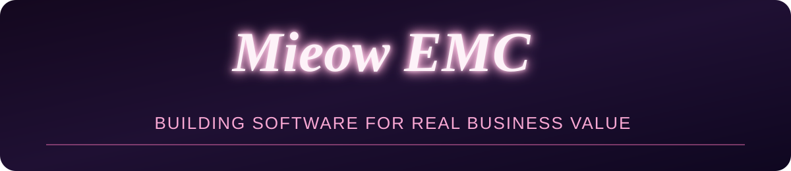
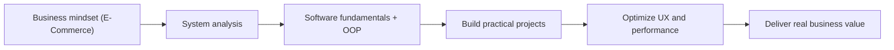
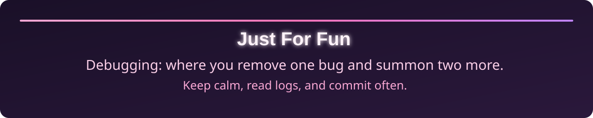

<h1 align="center">Hi, I'm EmBeHocCode 👋</h1>

  

  

  
  
  

  
  
  

---

## About Me
- 🎓 Major: **E-Commerce**
- 💻 Direction: **Software Engineering**
- 🔍 I enjoy understanding both **business logic** and **system logic**
- 🧠 Goal: build products that solve real problems, not just write code

> Good software starts with one question: **Why does this system need to exist?**

---

## Learning Roadmap

---

## Tech Stack (Learning & Using)

  
  
  
  
  
  
  
  
  

---

## Current Focus
- 📦 Learning **E-Commerce systems & workflows**
- 🧩 Practicing **software fundamentals, clean code, and OOP**
- 🔄 Improving **problem-solving through project-based learning**
- 🛠️ Building mini products that connect **business ideas + code**

---

## GitHub Stats

  
  

  

---

## A Thought I Like

  

---

## Just for Fun

  

  

