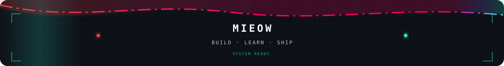

<div align="center">

  

  <br />

  

  <br />

  

  <br />

  <a href="https://bio.mieowparadise.io.vn/">
    
  </a>
  <a href="https://github.com/EmBeHocCode/EmBeHocCode/blob/main/CV.md">
    
  </a>
  <a href="https://github.com/EmBeHocCode">
    
  </a>

</div>


## `> whoami`

I'm **Mieow**, a third-year Information Technology student majoring in **E-Commerce**.

I enjoy turning product ideas into working software, especially projects that combine commerce workflows, useful automation, and practical AI integration.

```text
focus     product thinking · e-commerce · AI workflows
building  web products · automation tools · playful experiments
style     curious · independent · ship-first
```

## Tech constellation

<div align="center">
  
</div>

<br />

<div align="center">
  <sub>Currently deepening: system planning · end-to-end delivery · AI-assisted product development</sub>
</div>


## Explore my projects

<div align="center">

  From E-Commerce systems and AI experiments to games, utilities, and visual web projects.

  <br /><br />

  <a href="https://github.com/EmBeHocCode?tab=repositories">
    
  </a>

  <br /><br />

  
  
  
  

  <br />

  <sub>GitHub automatically shows visitors only the repositories that are public.</sub>

</div>


## GitHub pulse

<div align="center">
  
  <br />
  
  
</div>

## Current quest

- Building graduation-oriented E-Commerce products.
- Exploring AI features that solve real workflow problems.
- Improving architecture, documentation, testing, and product delivery.


## Find me in the digital garden

<div align="center">

  **Open to learning, collaboration, and interesting product ideas.**

  <a href="https://bio.mieowparadise.io.vn/">Portfolio</a>
  ·
  <a href="https://github.com/EmBeHocCode/EmBeHocCode/blob/main/CV.md">CV</a>
  ·
  <a href="https://www.facebook.com/hungng.0505/">Facebook</a>

  <br /><br />

  <sub>Build with intention. Learn by shipping. Stay curious.</sub>

</div>


